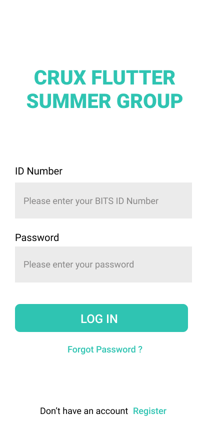
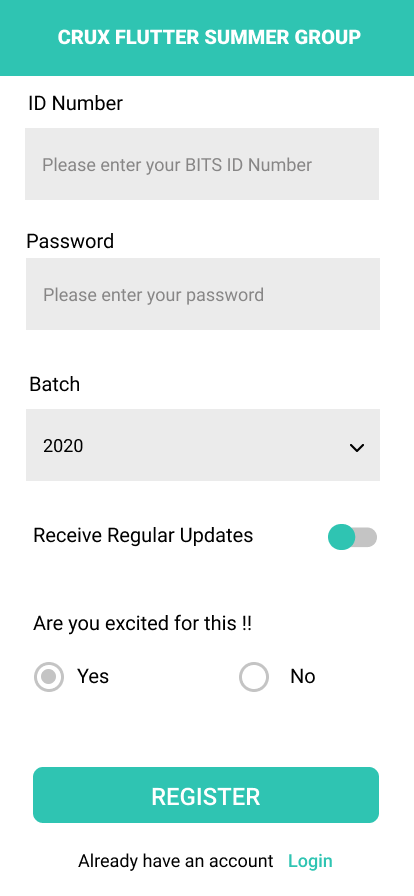

## Assignment 2

This is the first mini-project that you will be doing in this course, and you will be getting a good understanding of how to build a small part of a vast application.

#### Project Guidelines
1. Create a new project with the project name `assignment220xxyyyy`

2. **xx** denotes your batch year

3. **yyyy** denotes the last 4 digits of your ID Number

**Note**
- Please make sure you name the project with the given guidelines so that it will be considered for evaluation.
- Since last time was the first time, it was considered for breaking the naming guidelines, but if you are found to break the naming conventions penalty would be levied.

#### Project
In this project, try to recreate the design given below.

|  |  |  |
| --- | --- | --- |

##### Project Requirements
1. Login Screen
2. Register Screen
3. Greetings Screen

##### User Flow
1. On the application start, the login screen has to be shown with all the widgets present in the design.
2. Data need not be sent to Firebase/back-end server, but data must be saved inside the Login Screen Widget to send the data to the next Widget when navigated.
3. When the user clicks on Login Button, the page has to be navigated to the next screen, which is the Greetings Screen, and the data taken from the user ( BITS ID Number ) has to be shown on the Greetings Page.
4. Forgot Password need not work. Leave it as a regular Text Widget
5. Whenever user clicks on Register Text, the user has to be navigated to the Register Page, and all input has to be taken from him, and on Clicking Register button, he has to be navigated to Greetings Screen where again his ID Number has to be shown which is taken from the Register Screen.

- You have to use DropDown Widget, TextField ( or other equivalents) for the input, Radio Button, Switch Widget, TextButton ( or other counterparts), and the regular Layout Widgets for the recreation.

##### Customisation
- You can change the Color Theme of the application if you don't like it.
- But if you want to use the same Color Theme
		- Use `color : Color(0xff2FC4B2)` instead of `color: Colors.blue` wherever you are using the Color Theme.

**All the Best**