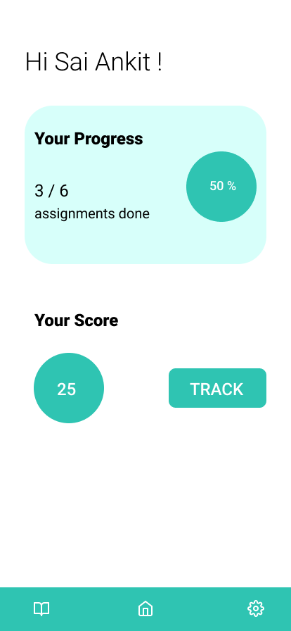
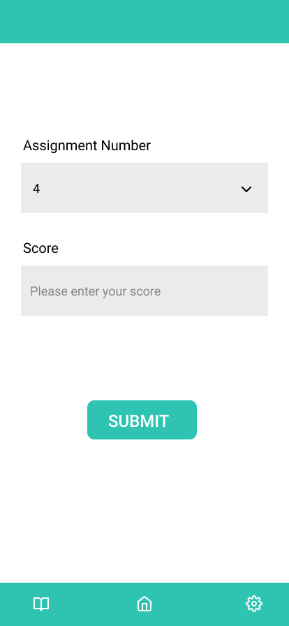
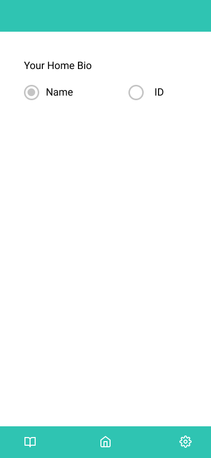
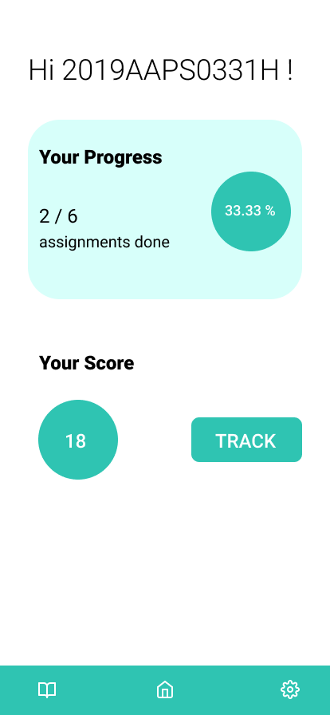

## Assignment 3

In this mini-project that you will be doing you will be getting a good understanding of how to integrate State management with the app.

#### Project Guidelines
1. Create a new project with the project name `assignment320xxyyyy`

2. **xx** denotes your batch year

3. **yyyy** denotes the last 4 digits of your ID Number

**Note**
- Please make sure you name the project with the given guidelines so that it will be considered for evaluation.
- Since last time was the first time, it was considered for breaking the naming guidelines, but if you are found to break the naming conventions penalty would be levied.

#### Project
In this project, try to recreate the design given below.

|  |  |
| --- | --- |
|  |  |

##### Project Requirements
1. Home Screen
2. Settings Screen
3. Track Screen

##### User Flow
#### First of all, I want to tell you guys that this particular project is an extension of Assignment 2 that you finished last week.
1. You can add a single feature of also taking the user's name in the last assignment.
2. After the users log in from the previous assignment, the user ID and Name have to be saved in saved preferences - a new file would be added regarding saved preferences on this module.
3. A bottom Nav bar with three icons pertaining to 3 screens has to be rendered. The bottom left - Course Modules Page ( which is empty for now ), Home Screen, and Settings Screen.
4. Inside the Home Page, we have the title as shown in the design, and whenever we change our preference in the Settings page what needs to be shown on the Home Screen, the title has to be updated automatically ( Use Provider State Management to achieve this)
5. We have a progress bar that shows the number of assignments we have finished.
6. The assignment tracking has to be manual on the next tracking page, where the user gives the input, and the data gets updated in a central state that manages the home screen progress and marks obtained ( State Management )

**All the Best**